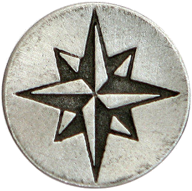
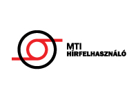

	
<h2 style="text-align: center;">
    &nbsp; Impresszum &nbsp;
</h2>

<h2 style="text-align: center;">
    new Scienction MAGazin
</h2>

	
    tudományosan szórakoztató internetes kiadvány 
        2016.01.01.     
	&nbsp; 
	
	&nbsp; 
	&nbsp; 
Vezérigazgatók: Lévai-Kiss Noémi és Ákos E. Kiss  
        Főszerkesztő: Kiss József Gábor          
        Főszerkesztő-helyettesek: Yin Gu &amp; Yan Gu          
	&nbsp; 
		olvasó szerkesztő: Csőke Ágnes          
		kép szerkesztő: Lévai-Kiss Noémi          
		tervező szerkesztő: Lévai István          
	&nbsp; 
    Rovat vezetők: 
		Hírek: Kiss József Gábor          
		Gazdaság: Ákos E. Kiss          
		Életmód: Lévai-Kiss Noémi          
		Irodalom: Csőké Ágnes          
		Szórakozás: Lévai István          
		Gyermek kuckó: Csőke Ágnes          
	&nbsp; 
    Technikai munkatársak  
		korrektor:  Csőke Ágnes, Lévai-Kiss Noémi (design)          
		fényképész: Lévai István, Ákos E.Kiss, Lévai-Kiss Noémi          
		jogi szakértő: Dr. Györkő Tünde          
	&nbsp; 
    A kiadó neve: 
		Global Scienction Publisher          
	&nbsp; 
    A szerkesztőség címe és elérhetőségei: 
		Bercsényi utca 6.           
		1111 Budapest          
	&nbsp; 
	E-mail: sry@sryer.com, yingu@yingu.hu, b6@b6.hu  
	&nbsp; 
    Nyomdai előkészítés: Yin Gu 
        Nyomdatechnika: Yin &amp; Yan Global Digital Print ( vezérigazgató: Yan Gu )          
	&nbsp; 
    Index, ISSN-szám: N/A 
	&nbsp; 

---

	

	&nbsp; 
    <b>Terjesztési információk: </b> 
		A tartalom a https://b6school/sciention internetes címen kizárólag digitális formában 
		jelenik meg. A magazin egyes fejezetei jellegüktől és aktualitásuktól függően változó 
		időközökben frissülnek. 
	&nbsp; 
	<b>Előfizetési információk: </b>  
		A kiadvány ingyenes és bármikor hozzáférhető a 
        https://b6school/sciention internetes címen. 
    <b>Jogi nyilatkozat: </b>  
	a./ Szolgáltató törekedik a szolgáltatás folyamatosságának hibamentes fenntartására, 
	de nem garantálja, hogy a honlap funkcionalitása, 
	és az általa nyújtott szolgáltatás mentes a hibáktól. 
	b./ A honlap és annak tartalma előzetes bejelentés nélkül bármikor változhat. 
	c./ Szolgáltató mindent megtesz annak érdekében, hogy a honlapon elhelyezett anyagok 
	vírusmentesek illetve egyéb kártékony programoktól mentesek legyenek. 
	d./ Szolgáltató semmilyen felelősséget nem vállal a honlap használatából 
	vagy használhatatlanságából eredő, Felhasználót a honlap használata során ért 
	vélt vagy valós károkért, esetleges számítógép meghibásodásokért. 
	A Felhasználó saját felelősségére használja a honlapot. 
	e./ Szolgáltató semmilyen felelősséget nem vállal azért, ha a tartalom Felhasználó 
	rendszerében kompatibilitási, vagy egyéb hibák miatt nem elérhető. 
	Az ebből eredő, Felhasználót ért vélt, vagy valós károkért, késedelemért 
	Szolgáltató nem tehető felelőssé. 
	f./ Szolgáltató bármikor jogosult a jelen általános felhasználási feltételek 
	egyoldalú módosítására azzal, hogy a módosításról rövid felhívás formájában 
	a Szolgáltatás kezdőoldalán tájékoztatja a Felhasználókat. 
	Amennyiben a Felhasználó a módosítást követően a Szolgáltatás bármely részét 
	használni kezdi, az a módosítás elfogadásának minősül. 
	g./ Szolgáltató fenntartja magának a jogot, hogy bármilyen jogsértés, vagy 
	Felhasználó által a jelen feltételek megszegése, vagy annak gyanúja esetén 
	Felhasználót a szolgáltatásból felszólítás nélkül véglegesen kizárja. 
	&nbsp; 
	<b>Adatvédelmi nyilatkozat: </b> 
	Szolgáltató vállalja és kötelezi magát, hogy a birtokába jutott valamennyi, 
	Felhasználóra vonatkozó adatot a mindenkori törvényes előírások betartásával 
	kezeli, azokat harmadik fél számára nem adja át, és kizárólag a szolgáltatás 
	működtetéséhez szükséges elengedhetetlen mértékben használja fel. 
	&nbsp; 

---

<h3 style="text-align: center;">Támogatóink:</h3>

	<b><i>
	b6.hu - sryer.com - yingu.hu - b6sics.hu - Plastdurker Kft. - OPL-Handels GmbH.
	</i></b> 
	&nbsp; 
	Az alapítók: 
	<b><i>A finom emberek társasága (Feynman Company)</i></b> 
	és az  
	<b><i>Egykő-kör (Einstein Circle)</i></b> 

